# Attention is All You Need
논문 : https://arxiv.org/abs/1706.03762   
WMT 2014 English-to-German(en-de) translation task에서 state-of-the-art 

코드 출처 : https://github.com/jadore801120/attention-is-all-you-need-pytorch

## 코드 사용법
1. Download the data
```
training : http://www.quest.dcs.shef.ac.uk/wmt16_files_mmt/training.tar.gz
validation : http://www.quest.dcs.shef.ac.uk/wmt16_files_mmt/validation.tar.gz
test : http://www.quest.dcs.shef.ac.uk/wmt16_files_mmt/mmt16_task1_test.tar.gz
```
data/multi30k 안에 모두 다 압축을 풀어준다.   

2. Preprocess the data
```
python preprocess.py -train_src data/multi30k/train.en.atok -train_tgt data/multi30k/train.de.atok -valid_src data/multi30k/val.en.atok -valid_tgt data/multi30k/val.de.atok -save_data data/multi30k.atok.low.pt
```

3. Train the model
```
python train.py -data data/multi30k.atok.low.pt -save_model trained -save_mode best -proj_share_weight -label_smoothing
```

4. Test the model
```
python translate.py -model trained.chkpt -vocab data/multi30k.atok.low.pt -src data/multi30k/test.en.atok -no_cuda
```
   
자세한 건 코드 출처 참고 

# Motivation
"I arrived at the bank after crossing the..."   
이런 문장에서 "bank"의 가장 적합한 의미와 적절한 표현을 학습하려면, 문장이 "...road"로 끝나는지, 아니면 "...river"로 끝나는지를 알아야 한다. (bank는 강둑이라는 의미와 은행이라는 의미를 둘 다 가지고 있음)
   
RNN은 물론 순차적으로 언어를 처리하는 과정에서 서로 멀리 있는 단어에 의존하는 의사 결정을 내리지만, recurrent network가 이러한 결정을 내리기까지 요구되는 time step의 수가 늘어날수록(서로 멀리 떨어져 있을수록) 어떻게 결정을 내리느냐 하는 문제는 더욱 어려워진다는 것이 밝혀져 있다. 또, 이러한 순차적 특성 때문에 TPU/GPU와 같은 최신 고속 컴퓨팅 장치를 최대한 활용하는 것이 어려울 수 밖에 없다. 참고적으로 CNN을 이용한 최신 언어 모델 아키텍쳐에서조차, 거리가 먼 부분의 정보들을 결합하는데 필요한 단계가, 그 거리가 멀어질수록 증가한다.   
  
```
현재 대부분의 Sequence model은 cnn이나 rnn을 encoder, decoder로써 활용하고 있다. 
그 중 가장 좋은 성능을 보이는 모델은 attention mechanism을 활용한 encoder, decoder 모델이다. 
우리는 cnn과 rnn을 없애고 attention에만 기반을 둔 단순한 network인 Transformer를 제안한다. 
이를 통해 paralleizable이 가능해졌고, train 시간을 대폭 감소시켰다.
```

즉, 기존에 cnn과 rnn, attention을 사용하던 걸 attention만 사용하자는 것이다. 논문에서는 Attention만 사용하는 간단한 신경망 구조(Transformer)를 통해 기계 번역 분야(특히, 영어에서 독일어로 번역)에서 state-of-the-art 성능을 얻음과 동시에 computation cost를 줄일 수 있었다고 한다.   
   
Transformer는 훨씬 작은 상수의 스텝만을 가지며(O(1)이라는 뜻) 각각의 스텝에서 self-attention 메커니즘은 문장의 모든 단어에 대해서 직접적인 관계를 모델링하며, 이 때는 각각의 개별 포지션과는 무관하다. 즉 "bank"의 의미를 식별하기 위해서 Transformer의 경우 "river"라는 단어를 <strong>즉각적으로</strong> 참고하는 방법을 배울 수 있으며, 단일 스텝 내에서 이 결정을 하게 된다.   
Transformer에서는 학습 시 encoder에서는 각각의 position에 대해, 즉 각각의 단어에 대해 attention을 해주기만 하고, decoder에서는 masking 기법을 이용해 병렬 처리가 가능하게 된다. decoderdptjsms decoder에서는 encoder와 달리 순차적으로 겨로가를 만들어내야 하기 때문에, self-attention을 변형하여 masking을 해준다. masking을 통해 position i보다 이후에 있는 position에 attention을 주지 못하게 한다. 즉, position i에 대한 예측은 미리 알고 있는 output들에만 의존을 하는 것이다.

<p align='center'>

</p>

위 예시를 보면, a를 예측할 때는 a 이후에 있는 b,c에는 attention이 주어지지 않는다. b를 예측할 때는 b 이전에 있는 a만 attention이 주어질 수 있고 이후에 있는 c는 attention이 주어지지 않는다.

인코더에서부터 self attention 메커니즘이 활용되며, "I arrived at the bank after crossing the river"이라는 위 문장에서 "bank"라는 단어의 representation을 결정할 때, "river"는 높은 가중치를 부여받아 가중 평균될 수 있다는 것이다.   
아래 두 그림은 'it'이후의 문장이 달라 같은 it이지만 가리키는 단어가 다르다. self attention 메커니즘을 통해서 각각 'animal'과 'street'에 더 적절히 가중치를 주고 있다는 것을 알 수 있다.(진한 푸른색으로 표기됨)

<p align='center'>

</p>

paralleization은 data를 parallel하게 처리할 수 있도록 computer program이나 system을 설계하는 것을 말한다. (보통 computer program은 data를 serially 처리한다)

RNN 모델은 input과 output sequence의 position들을 계산하는데 뛰어나다. 이 position대로 순서대로 연산을 하면서, 이전 hidden state <strong><i>h<sub>t-1</sub></i></strong>와 그 position의 input <strong><i>t</i></strong>를 통해 새로운 hidden state <strong><i>h<sub>t</sub></i></strong>를 만들어 낸다. 따라서 구조상 sequential한 특성을 가지고 있기에, 이는 parallelization에 취약하다는 단점이 있다. 이는 sequence길이가 길어진 경우 batch로써 풀고자 할 때 큰 문제가 된다.

# Attention Model의 장점
* <strong><font color="red">해석 가능하다(interpretable)!!!!!!</font></strong>(model이 어디에 attention을 줘서 그러한 결론을 내렸는지 알 수 있다)
* 각각 layer마다 필요로 하는 총 computing cost가 줄어든다.
* 병렬화가 가능한 computation이 늘어난다.(sequential operation을 필요로 하는 부분이 줄어든다)
* 신경망 내에서 long-range dependencies를 잇는 path length가 줄어든다.

참고 : path length란?
번역 문제 같은 sequence transduction problem에서는 input sequence와 output sequence가 길어지면 두 position간의 거리가 먼 경우에 그 의존성을 학습하기 힘들다는 문제가 있다. 이것을 Maximum Path Length를 이용해 표현하였다. 의존성을 학습하기 위해 거쳐야하는 connection이 최대 몇 단계가 필요한가를 나타내는 수치로서, 이 path의 길이가 짧을수록 position 간의 의존성을 학습하기 쉬워진다고 할 수 있다.

# Transformer Model Architecture
<p align='center'>

</p>

# Embeddings and Softmax
embedding 값을 고정시키지 않고, 학습을 하면서 embedding값이 변경되는 learned embedding을 사용했다. 이 때 input과 output은 같은 embedding layer를 사용한다. 또한 decoder output을 다음 token의 확률로 바꾸기 위해 learned linear transformation과 softmax function을 사용했다. learned linear transformation을 사용했다는 것은 decoder output에 weight matrix W를 곱해주는데, 이 때 W가 학습된다는 의미다.

# Scaled Dot-Product Attention
해당 논문의 attention을 <strong>Scaled Dot-Product Attention</strong>이라고 부른다. 수식을 살펴보면 이렇게 부르는 이유를 알 수 있다.
<p align='center'>

</p>
<p>
먼저 input은 <i>d<sub>k</sub></i> dimension의 query와 key들, <i>d<sub>v</sub></i> dimension의 value들로 이루어져 있다. 이 때 모든 query와 key에 대한 dot-product를 계산하고 각각을 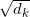로 나누어준다. dot-product를 하고 으로 scaling을 해주기 때문에 Scaled Dot-Product Attention인 것이다. 그리고 여기에 softmax를 적용해 value들에 대한 weights를 얻어낸다. 
</p>
<p>
key와 value는 attention이 이루어지는 위치에 상관없이 같은 값을 갖게 된다. 이 때 query와 key에 대한 dot-product를 계산하면 각각의 query와 key 사이의 유사도를 구할 수 있게 된다. 흔히 들어본 cosine similarity는 dot-product에서 vector의 magnitude로 나눈 것이다. 로 scaling을 해주는 이유는 dot-products의 값이 커질수록 softmax 함수에서 기울기의 변화가 거의 없는 부분으로 가기 때문이다.
</p>
softmax를 통과한 값을 value에 곱해준다면, query와 유사한 value일수록, 즉 중요한 value일수록 더 높은 값을 가지게 된다. 중요한 정보에 더 관심을 둔다는 attention의 원리에 알맞은 것이다.

# Multi-Head Attention
<p align='center'>
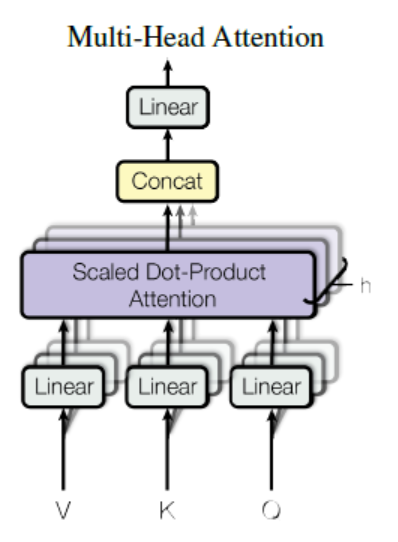
</p>
위의 그림을 수식으로 나타내면 다음과 같다.
<p align='center'>
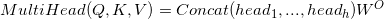
</p>
<p align='center'>
where 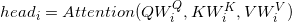
</p>
<p align='center'>
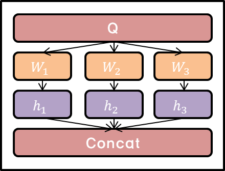
</p>

<i>d<sub>model</sub></i> dimension의 key, value, query들로 하나의 attention을 수행하는 대신 key, value, query들에 각각 다른 학습된 linear projection을 h번 수행하는 게 더 좋다고 한다. 즉, 동일한 Q,K,V에 각각 다른 weight matrix <i>W</i>를 곱해주는 것이다. 이 때 parameter matrix는 다음과 같다.
<p align='center'>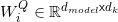</p>
<p align='center'>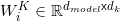</p>
<p align='center'>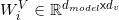</p>
<p align='center'>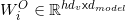</p>
순서대로 query, key, value, output에 대한 parameter matrix이다. projection이라고 하는 이유는 각각의 값들이 parameter matrix와 곱해졌을 때 <i>d<sub>k</sub></i>, <i>d<sub>v</sub></i>, <i>d<sub>model</sub></i> 차원으로 project되기 때문입니다.   
논문에서는 <i>d<sub>k</sub></i> = <i>d<sub>v</sub></i> = <i>d<sub>model</sub></i>/h를 사용했는데 꼭 <i>d<sub>k</sub></i>와 <i>d<sub>v</sub></i>가 같을 필요는 없습니다.   
이렇게 project된 key, value, query들은 병렬적으로 attention function을 거쳐 <i>d<sub>v</sub></i> dimension output값으로 나오게 된다.   
그 다음 여러 개의 head를 concatenate하고 다시 projection을 수행한다. 그리하여 최종적인 <i>d<sub>model</sub></i> dimension output값이 나오게 된다. 각각의 과정에서 dimension을 표현하면 다음과 같다.
<p align='center'>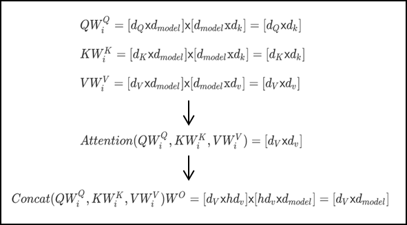</p>
<p align='center'><i>d<sub>Q</sub></i>, <i>d<sub>K</sub></i>, <i>d<sub>V</sub></i>는 각각 query, key, value</p> 

# Self-Attention
## encoder self-attention layer
<p align='center'>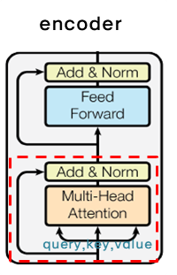</p>
key, value,s query들은 모두 encoder의 이전 layer의 output에서 온다. 따라서 이전 layer의 모든 position에 attention을 줄 수 있다. 만약 첫 번째 layer라면 positional encoding이 더해진 input embedding이 된다.

## decoder self-attention layer
<p align='center'>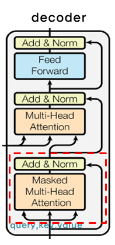</p>
encoder와 비슷하게 decoder에서도 self-attention을 줄 수 있다. 하지만 <i>i</i>번째 output을 다시 <i>i+1</i>번째 input으로 사용하는 auto-regressive한 특성을 유지하기 위해, masking out된 scaled dot-product attention을 적용했다.
<p>masking out이 됐다는 것은 i번째 position에 대한 attention을 얻을 때, i번째 이후에 있는 모든 position은 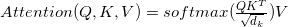에서 softmax의 input 값을 -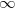로 설정한 것이다. 이렇게 한다면 i번째 이후에 있는 position에 attention을 주는 경우가 없을 것이다.</p>

## Encoder-Decoder Attention Layer
<p align='center'>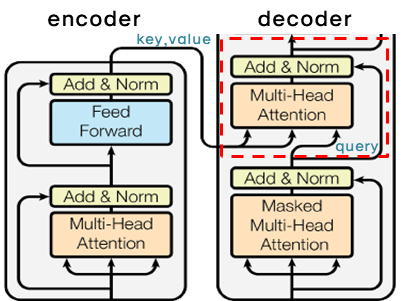</p>
query들은 이전 decoder layer에서 오고 key와 value들은 encoder의 output에서 온다. 그래서 decoder의 모든 position에서 input sequence 즉, encoder output의 모든 position에 attention을 줄 수 있게 된다.   
query가 decoder layer의 output인 이유는 <i>query</i>라는 것이 조건에 해당하기 때문이다. 좀 더 풀어서 설명하면, '지금 decoder에서 이런 값이 나왔는데 무엇이 output이 돼야 할까?'가 query인 것이다.   
이 때 query는 이미 이전 layer에서 masking out됐으므로, i번째 position까지만 attention을 얻게 된다. 이 같은 과정은 sequence-to-sequence의 전형적인 encoder-decoder mechanisms를 따라한 것이다.   
모든 position에서 attention을 줄 수 있다는 게 이해가 안되면 <a href='http://mlexplained.com/2017/12/29/attention-is-all-you-need-explained/'>링크</a>를 참고바람

# Position-wise Feed-Forward Networks
encoder와 decoder의 각각의 layer는 아래와 같은 fully connected feed-forward network를 포함하고 있다.
<p align='center'>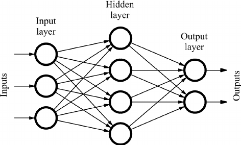</p>
position마다, 즉 개별 단어마다 적용되기 때문에 position-wise이다. network는 두 번의 linear transformation과 activation function ReLU로 이루어져 있다. 
<p align='center'>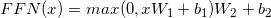</p>
<p align='center'>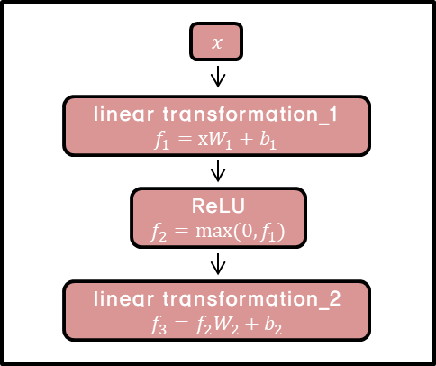</p>
<p>x에 linear transformation을 적용한 뒤, 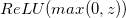를 거쳐 다시 한 번 linear transformation을 적용한다. <i>W,b</i>의 아래 첨자가 다른 것에서 볼 수 있듯이 같은 형태지만 layer가 달라지면 다른 parameter를 사용한다. kernel size가 1이고 channel이 layer인 convolution을 두 번 수행한 것으로도 위 과정을 이해할 수 있다. 

# Positional Encoding
Transformers는 recurrence도 아니고 convolution도 아니기 때문에, 단어의 position 정보를 저장해줄 필요가 있다. 그래서 encoder와 decoder의 input embedding에 positional encoding을 더해주었다. positional encoding은 <i>d<sub>model</sub></i>(embedding 차원)과 같은 차원을 갖기 때문에 positional encoding vector와 embedding vector는 더해질 수 있다.   
논문에서는 다른 frequency를 가지는 sine과 cosine 함수를 이용했다. 
* 주어진 구간내에서 완료되는 cycle의 개수
<p align='center'>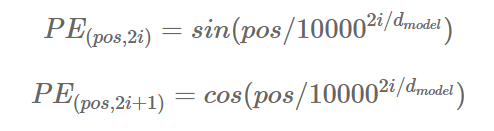</p>
<p>
   <i>pos</i>는 position, <i>i</i>는 dimension이고 주기가 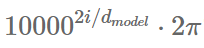인 삼각 함수이다. 즉, <i>pos</i>는 sequence에서 단어의 위치이고 해당 단어는 <i>i</i>에 0부터 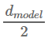까지를 대입해 <i>d<sub>model</sub></i>차원의 positional encoding vector를 얻게 된다. <i>k = 2i + 1</i>일 때는 cosine 함수를, <i>k = 2i</i>일 때는 sine 함수를 이용한다. 이렇게 positional encoding vector를 <i>pos</i>마다 구한다면 비록 같은 column이라고 할지라도 <i>pos</i>가 다르다면 다른 값을 가지게 된다. 즉, <i>pos</i>마다 다른 <i>pos</i>와 구분되는 positional encoding 값을 얻게 된다.
</p>
<p align='center'>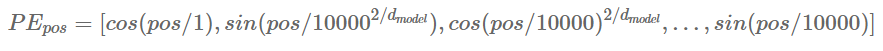</p>
<p>
   이 때 <i>PE<sub>pos+k</sub></i>는 <i>PE<sub>pos</sub></i>의 linear function으로 나타낼 수 있다. 표기를 간단히 하기 위해 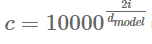라고 해봅시다. 
</p>
<p align='center'><font size="4"><i>sin(a + b) = sin(a)cos(b) + cos(a)sin(b)</i></font></p>      
<p align='center'><font size="4"><i>cos(a + b) = cos(a)cos(b) - sin(a)sin(b)</i></font></p>
위의 공식을 사용하여 다음과 같이 바꿀 수 있다.   

<p align='center'>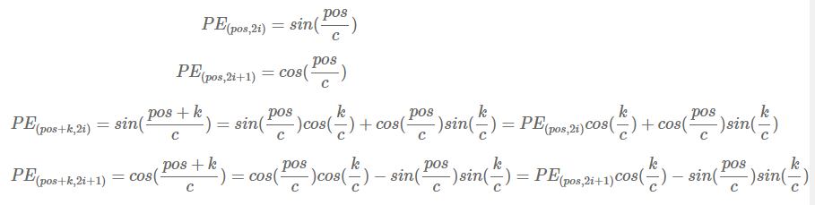</p>
이런 성질 때문에 model이 relative position에 의해 attention하는 것을 더 쉽게 배울 수 있다.   
논문에서는 학습된 positional embedding 대신 sinusoidal version을 선택했다. 만약 학습된 positional embedding을 사용할 경우 training보다 더 긴 sequence가 inference시에 입력으로 들어온다면 문제가 되지만 sinusoidal의 경우 constant하기 때문에 문제가 되지 않는다. 그냥 좀 더 많은 값을 계산하면 되기 때문이다.

# Training
## Optimizer
많이 쓰이는 Adam optimizer를 사용했다. 특이한 점은 learning rate를 training동안 고정시키지 않고 다음 식에 따라 변화시켰다는 점이다.
<p align='center'>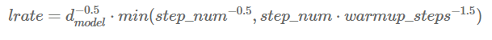</p>
<p align='center'>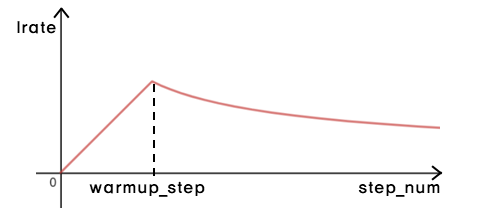</p>
<i>warmup_step</i>까지는 linear하게 learning rate를 증가시키다가, <i>warmup_step</i> 이후에는 <i>step_num</i>의 inverse square root에 비례하도록 감소시킨다. 이렇게 하는 이유는 처음에는 학습이 잘 되지 않은 상태이므로 learning rate를 빠르게 증가시켜 변화를 크게 주다가, 학습이 꽤 됐을 시점에 learning rate를 천천히 감소시켜 변화를 작게 주기 위해서이다. 이렇게 할거면 learning rate를 증가시킬 필요 없이 그냥 처음부터 크게 주다가 줄여나가기만 하면 되는 게 아닌가 생각했었다. 찾아보니 learning rate가 증가하는 구간에서는 local minima에서 빠져나오기 쉽다고 한다.

## Regularization
### Residual Connection
<a href="https://arxiv.org/abs/1603.05027">Identity Mappings in Deep Residual Networks</a>라는 논문에서 제시된 방법이고, 아래의 수식이 residual connection을 나타낸 것이다.
<p align='center'>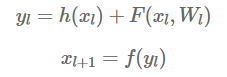</p>
이 때 <i>h(x<sub>l</sub>) = x<sub>l</sub></i>이다. 논문 제목에서 나온 것처럼 identity mapping을 해주는 것이다. 특정한 위치에서의 <i>x<sub>L</sub></i>을 다음과 같이 <i>x<sub>l</sub></i>과 residual 함수의 합으로 표시할 수 있습니다.
<p align='center'>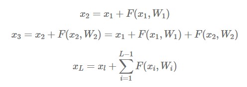</p>
그리고 미분을 한다면 다음과 같이 된다.
<p align='center'>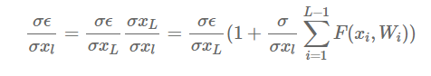</p>
<p>이 때, 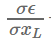은 상위 layer의 gradient 값이 변하지 않고 그대로 하위 layer에 전달되는 것을 보여준다. 즉, layer를 거칠수록 gradient가 사라지는 vanishing gradient 문제를 완화해주는 것이다. 또한 Forward path나 Backward path를 간단하게 표현할 수 있게 된다.

### Layer Normalization
<a href="https://arxiv.org/abs/1607.06450">Layer Normalization</a>이라는 논문에서 제시된 방법이다.
<p align='center'>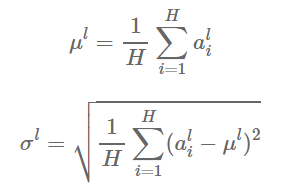</p>
<p> 같은 layer에 있는 모든 hidden unit은 동일한 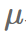와 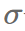를 공유한다.
   그리고 현재 input <i>x<sup>t</sup></i>, 이전의 hidden state <i>h<sup>t-1</sup></i>, <i>a<sup>t</sup> = W<sub>hh</sub>h<sup>t-1</sup> + W<sub>xh</sub>x<sup>t</sup></i>, parameter <i> g,b </i>가 있을 때 다음과 같이 normalization을 해준다.</p>
<p align='center'>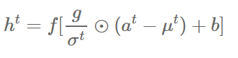</p>
이렇게 한다면, gradient가 exploding하거나 vanishing하는 문제를 완화시키고 gradient 값이 안정적인 값을 가짐으로써 더 빨리 학습을 시킬 수 있다. (논문에서 recurrent를 기준으로 설명했으므로 이에 따름)

### Dropout
<a href="http://jmlr.org/papers/volume15/srivastava14a.old/srivastava14a.pdf">Dropout: a simple way to prevent neural networks from overfitting</a>이라는 논문에서 제시된 방법이다.   
<p align='center'>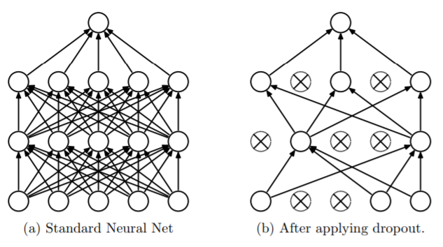</p>
dropout이라는 용어는 neural network에서 unit들을 dropout하는 것을 가리킨다. 즉, 해당 unit을 network에서 일시적으로 제거하는 것이다. 그래서 다른 unit과의 모든 connection이 사라지게 된다. 어떤 unit을 dropout할지는 random하게 정한다.   
dropout은 training data에 overfitting되는 문제를 어느정도 막아준다. dropout된 unit들은 training되지 않는 것이니 training data에 값이 조정되지 않기 때문이다.

### Label Smoothing
<a href="https://arxiv.org/pdf/1512.00567.pdf">Rethinking the inception architecture for computer vision</a>이라는 논문에서 제시된 방법이다.   
training동안 실제 정답인 label의 logit은 다른 logit보다 훨씬 큰 값을 갖게 된다. 이렇게 해서 model이 주어진 input x에 대한 label y를 맞추는 것이다. 하지만 이렇게 된다면 문제가 발생한다. overfitting될수도 있고 가장 큰 logit을 가지는 것과 나머지 사이의 차이를 점점 크게 만든다. 결국 model이 다른 data에 적응하는 능력을 감소시킨다.   
<p>model이 덜 confident하게 만들기 위해, label distribution 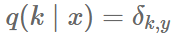(k가 y일 경우 1, 나머지는 0)를 다음과 같이 대체할 수 있다. </p>
<p align='center'>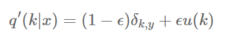</p>
각각 label에 대한 분포 ,u(k), smoothing parameter 입실론이다. 위와 같다면, k=y인 경우에도 model은 p(y|x)=1이 아니라 p(y|x) = (1-입실론)이 된다. 100%의 확신이 아닌 그보다 덜한 확신을 하게 되는 것이다.   
   
# Conclusion
Transformer는 recurrence를 이용하지 않고도 빠르고 정확하게 sequential data를 처리할 수 있는 model로 제시되었다. 여러가지 기법이 사용됐지만, 가장 핵심적인 것은 encoder와 decoder에서 attention을 통해 query와 가장 밀접한 연관성을 가지는 value를 강조할 수 있고 병렬화가 가능해진 것이다.

# 참고자료
1. 논문 - Attention Is All You Need : https://arxiv.org/abs/1706.03762
2. Github - Attention Is All You Need 논문 리뷰 :  https://github.com/YBIGTA/DeepNLP-Study/wiki/Attention-Is-All-You-Need-%EB%85%BC%EB%AC%B8%EB%A6%AC%EB%B7%B0
3. 수업자료
4. Parallelization : https://www.computerhope.com/jargon/p/parallelization.htm
5. 블로그 - 논문 요약 Attention Is All You Need : https://hist0134.blog.me/221035988217
6. Sequence to Sequence 네트워크와 Attention을 이용한 번역 : https://9bow.github.io/PyTorch-tutorials-kr-0.3.1/intermediate/seq2seq_translation_tutorial.html
7. 논문 - Attention Mechanism 설명 - Neural Machine Translation by Jointly Learning to Align and Translate : https://arxiv.org/abs/1409.0473
8. Natural Language Processing with PyTorch - Attention is all you need 리뷰 : https://kh-kim.gitbook.io/natural-language-processing-with-pytorch/cover-9/transformer
9. using keras encoder-decoder with attention : https://machinelearningmastery.com/encoder-decoder-attention-sequence-to-sequence-prediction-keras/
10. Github-Attention is all you need, keras 구현 : https://github.com/Lsdefine/attention-is-all-you-need-keras/blob/master/transformer.py
11. 어텐션 메커니즘 - https://ratsgo.github.io/from%20frequency%20to%20semantics/2017/10/06/attention/
12. Attention is all you need paper 뽀개기 : https://pozalabs.github.io/transformer/
