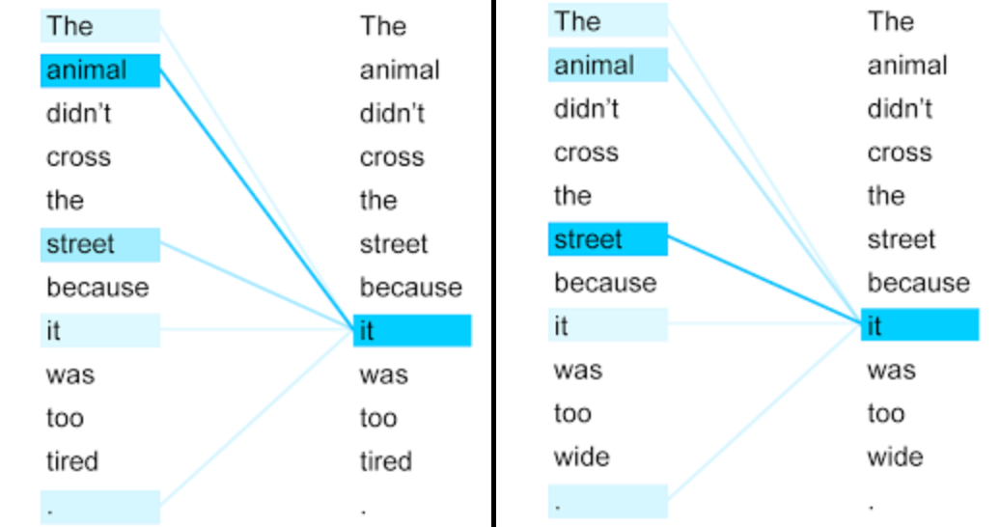
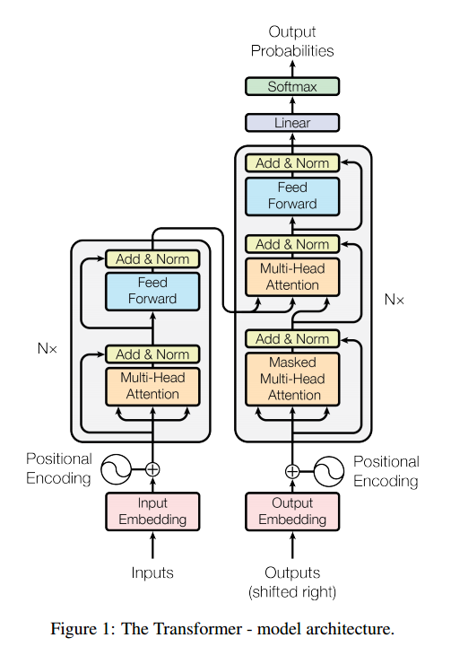

# motivation
"I arrived at the bank after crossing the..."   
이런 문장에서 "bank"의 가장 적합한 의미와 적절한 표현을 학습하려면, 문장이 "...road"로 끝나는지, 아니면 "...river"로 끝나는지를 알아야 한다. (bank는 강둑이라는 의미와 은행이라는 의미를 둘 다 가지고 있음)
   
RNN은 물론 순차적으로 언어를 처리하는 과정에서 서로 멀리 있는 단어에 의존하는 의사 결정을 내리지만, recurrent network가 이러한 결정을 내리기까지 요구되는 time step의 수가 늘어날수록(서로 멀리 떨어져 있을수록) 어떻게 결정을 내리느냐 하는 문제는 더욱 어려워진다는 것이 밝혀져 있다. 또, 이러한 순차적 특성 때문에 TPU/GPU와 같은 최신 고속 컴퓨팅 장치를 최대한 활용하는 것이 어려울 수 밖에 없다. 참고적으로 CNN을 이용한 최신 언어 모델 아키텍쳐에서조차, 거리가 먼 부분의 정보들을 결합하는데 필요한 단계가, 그 거리가 멀어질수록 증가한다.   
  
```
현재 대부분의 Sequence model은 cnn이나 rnn을 encoder, decoder로써 활용하고 있다. 
그 중 가장 좋은 성능을 보이는 모델은 attention mechanism을 활용한 encoder, decoder 모델이다. 
우리는 cnn과 rnn을 없애고 attention에만 기반을 둔 단순한 network인 Transformer를 제안한다. 
이를 통해 paralleizable이 가능해졌고, train 시간을 대폭 감소시켰다.
```

즉, 기존에 cnn과 rnn, attention을 사용하던 걸 attention만 사용하자는 것이다. 논문에서는 Attention만 사용하는 간단한 신경망 구조(Transformer)를 통해 기계 번역 분야(특히, 영어에서 독일어로 번역)에서 state-of-the-art 성능을 얻음과 동시에 computation cost를 줄일 수 있었다고 한다.   
   
Transformer는 훨씬 작은 상수의 스텝만을 가지며(O(1)이라는 뜻) 각각의 스텝에서 self-attention 메커니즘은 문장의 모든 단어에 대해서 직접적인 관계를 모델링하며, 이 때는 각각의 개별 포지션과는 무관하다. 즉 "bank"의 의미를 식별하기 위해서 Transformer의 경우 "river"라는 단어를 <strong>즉각적으로</strong> 참고하는 방법을 배울 수 있으며, 단일 스텝 내에서 이 결정을 하게 된다.   
Transformer에서는 학습 시 encoder에서는 각각의 position에 대해, 즉 각각의 단어에 대해 attention을 해주기만 하고, decoder에서는 masking 기법을 이용해 병렬 처리가 가능하게 된다. decoderdptjsms decoder에서는 encoder와 달리 순차적으로 겨로가를 만들어내야 하기 때문에, self-attention을 변형하여 masking을 해준다. masking을 통해 position i보다 이후에 있는 position에 attention을 주지 못하게 한다. 즉, position i에 대한 예측은 미리 알고 있는 output들에만 의존을 하는 것이다.
<center>

</center>
위 예시를 보면, a를 예측할 때는 a 이후에 있는 b,c에는 attention이 주어지지 않는다. b를 예측할 때는 b 이전에 있는 a만 attention이 주어질 수 있고 이후에 있는 c는 attention이 주어지지 않는다.

인코더에서부터 self attention 메커니즘이 활용되며, "I arrived at the bank after crossing the river"이라는 위 문장에서 "bank"라는 단어의 representation을 결정할 때, "river"는 높은 가중치를 부여받아 가중 평균될 수 있다는 것이다.   
아래 두 그림은 'it'이후의 문장이 달라 같은 it이지만 가리키는 단어가 다르다. self attention 메커니즘을 통해서 각각 'animal'과 'street'에 더 적절히 가중치를 주고 있다는 것을 알 수 있다.(진한 푸른색으로 표기됨)
<center>

</center>
   
paralleization은 data를 parallel하게 처리할 수 있도록 computer program이나 system을 설계하는 것을 말한다. (보통 computer program은 data를 serially 처리한다)

RNN 모델은 input과 output sequence의 position들을 계산하는데 뛰어나다. 이 position대로 순서대로 연산을 하면서, 이전 hidden state <strong><i>h<sub>t-1</sub></i></strong>와 그 position의 input <strong><i>t</i></strong>를 통해 새로운 hidden state <strong><i>h<sub>t</sub></i></strong>를 만들어 낸다. 따라서 구조상 sequential한 특성을 가지고 있기에, 이는 parallelization에 취약하다는 단점이 있다. 이는 sequence길이가 길어진 경우 batch로써 풀고자 할 때 큰 문제가 된다.

# Attention Model의 장점
* <strong><font color="red">해석 가능하다(interpretable)!!!!!!</font></strong>(model이 어디에 attention을 줘서 그러한 결론을 내렸는지 알 수 있다)
* 각각 layer마다 필요로 하는 총 computing cost가 줄어든다.
* 병렬화가 가능한 computation이 늘어난다.(sequential operation을 필요로 하는 부분이 줄어든다)
* 신경망 내에서 long-range dependencies를 잇는 path length가 줄어든다.

참고 : path length란?
번역 문제 같은 sequence transduction problem에서는 input sequence와 output sequence가 길어지면 두 position간의 거리가 먼 경우에 그 의존성을 학습하기 힘들다는 문제가 있다. 이것을 Maximum Path Length를 이용해 표현하였다. 의존성을 학습하기 위해 거쳐야하는 connection이 최대 몇 단계가 필요한가를 나타내는 수치로서, 이 path의 길이가 짧을수록 position 간의 의존성을 학습하기 쉬워진다고 할 수 있다.

# Transformer Model Architecture


# Embeddings and Softmax
embedding 값을 고정시키지 않고, 학습을 하면서 embedding값이 변경되는 learned embedding을 사용했다. 이 때 input과 output은 같은 embedding layer를 사용한다. 또한 decoder outputㅇ르 다음 token의 확률로 바꾸기 위해 learned linear transformation과 softmax function을 사용했다. learned linear transformation을 사용했다는 것은 decoder output에 weight matrix W를 곱해주는데, 이 때 W가 학습된다는 의미다.

# Scaled Dot-Product Attention
해당 논문의 attention을 <strong>Scaled Dot-Product Attention</strong>이라고 부른다. 수식을 살펴보면 이렇게 부르는 이유를 알 수 있다.
<center>

</center>
먼저 input은 <i>d<sub>k</sub></i> dimension의 query와 key들, <i>d<sub>v</sub></i> dimension의 value들로 이루어져 있다.

# 참고자료
1. 논문 - Attention Is All You Need : https://arxiv.org/abs/1706.03762
2. Github - Attention Is All You Need 논문 리뷰 :  https://github.com/YBIGTA/DeepNLP-Study/wiki/Attention-Is-All-You-Need-%EB%85%BC%EB%AC%B8%EB%A6%AC%EB%B7%B0
3. 수업자료
4. Parallelization : https://www.computerhope.com/jargon/p/parallelization.htm
5. 블로그 - 논문 요약 Attention Is All You Need : https://hist0134.blog.me/221035988217
6. Sequence to Sequence 네트워크와 Attention을 이용한 번역 : https://9bow.github.io/PyTorch-tutorials-kr-0.3.1/intermediate/seq2seq_translation_tutorial.html
7. 논문 - Attention Mechanism 설명 - Neural Machine Translation by Jointly Learning to Align and Translate : https://arxiv.org/abs/1409.0473
8. Natural Language Processing with PyTorch - Attention is all you need 리뷰 : https://kh-kim.gitbook.io/natural-language-processing-with-pytorch/cover-9/transformer
9. using keras encoder-decoder with attention : https://machinelearningmastery.com/encoder-decoder-attention-sequence-to-sequence-prediction-keras/
10. Github-Attention is all you need, keras 구현 : https://github.com/Lsdefine/attention-is-all-you-need-keras/blob/master/transformer.py
11. 어텐션 메커니즘 - https://ratsgo.github.io/from%20frequency%20to%20semantics/2017/10/06/attention/
12. Attention is all you need paper 뽀개기 : https://pozalabs.github.io/transformer/
