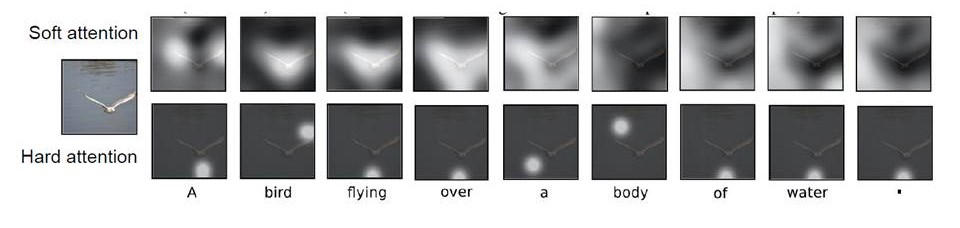
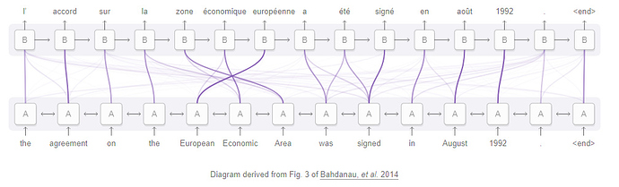
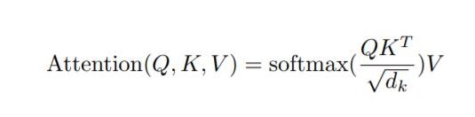
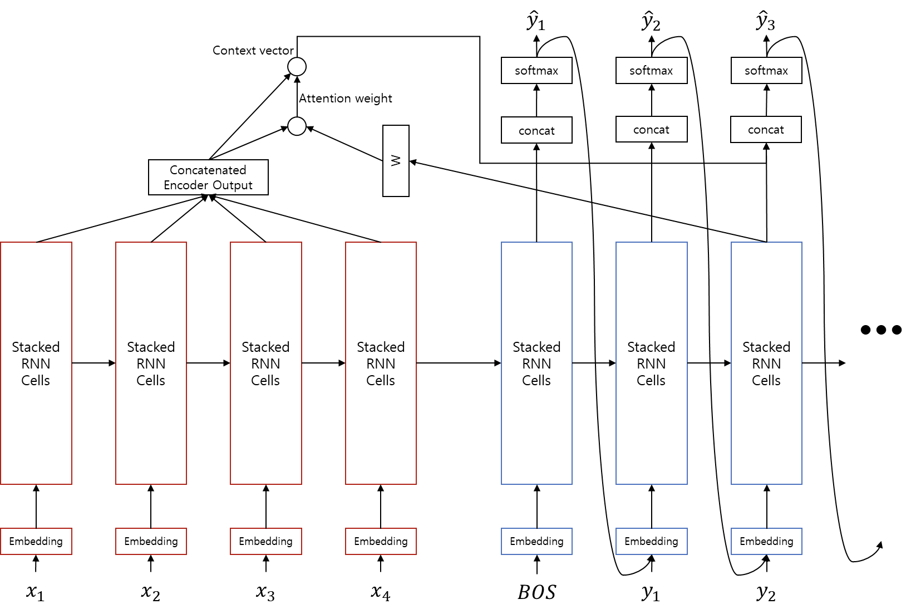
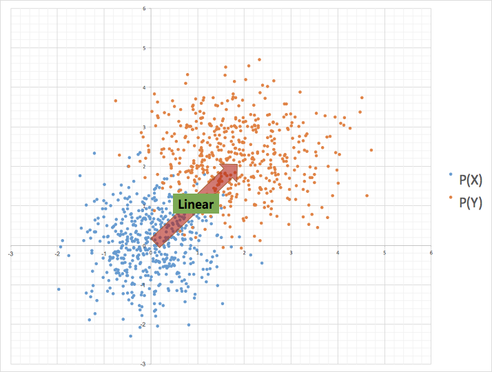
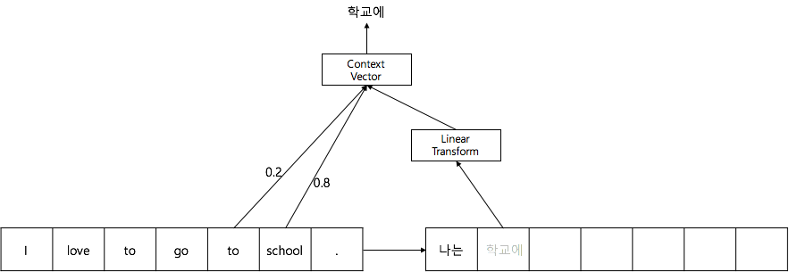
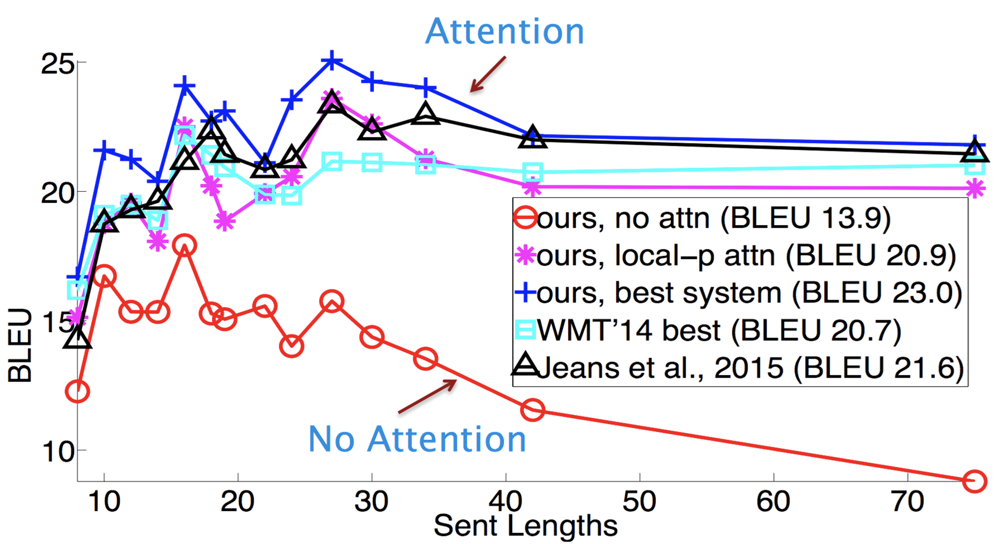

# Attention
<p align='center'>
           
<strong>그림을 보고 Captioning 하는 예시</strong>
</p> 
   
Attention이란 위의 그림과 같이 사람이 그림을 볼 때 특정 부분에 Attention을 하여 어떤 그림인지를 아는 것처럼 컴퓨터로 이를 구현해보고자 하는 것이다. 

<p align='center'>

</p>
<p align='center'>
<strong>Attention을 활용한 번역 visualization</strong>
</p>   
   
Attention은 번역에도 활용할 수 있다. 위의 그림은 번역을 할 때 attention을 visualization한건데 어떤 단어에 집중 또는 단어 간의 관계로 볼 수도 있다. 선이 진할수록 관계도가 높은 것이다.   
   
## Query, Key, Value 

Attention은 쿼리(Query)와 비슷한 값을 가진 키(Key)를 찾아서 그 값(Value)를 얻는 과정이다. 

Key-Value는 개념은 컴퓨터 자료구조에서 볼 수 있다. 그 외 여러 곳에서도 쓰이는데 python의 Dictionary를 예시로 들면
```dic = {'computer': 9, 'dog': 2, 'cat': 3}```   
Key와 Value에 해당하는 값을 저장해놓고 Key를 통해 Value 값에 접근할 수 있다. Query를 주고 그 Key값에 따라 Value 값에 접근할 수 있다.
위의 작업을 함수로 나타낸다면 다음과 같이 표현할 수 있다.(이해를 돕기 위한 것으로 실제 파이썬 딕셔너리의 동작과는 다름)
```
def key_value_func(query):
   weights = []

   for key in dic.keys():
      weights += [is_same(key, query)]

   weight_sum = sum(weights)
   for i, w in enumerate(weights):
      weights[i] = weights[i] / weight_sum

   answer = 0

   for weight, value in zip(weights, dic.values()):
      answer += weight * value

   return answer

def is_same(key, query):
   if key == query:
      return 1.
   else:
      return .0
```
코드를 살펴보면, 순차적으로 'dic'변수 내부의 key값들과 query값을 비교하여, key가 같을 경우 'weights'변수에 1.0을 더하고, 다를 경우에는 0을 더한다. 그리고 각 'weights'를 'weights'의 총 합으로 나누어 그 합이 1이 되도록 만들어 준다.(자료구조에서 key는 유일성으로 중복되지 않아 어떤 쿼리와 일치하는 key는 1개보다 많을 수 없고 is_same함수로 같을 경우메만 1이고 아니면 0이므로 weights의 합은 항상 1이거나 0일 것이다. 그래서 이 과정은 여기서는 필요 없지만 다음에 나올 query와 key의 유사도를 계산하는 과정에서는 필요하다) 다시 'dic'내부의 value 값들과 'weights'의 값에 대해서 곱하여 더해줍니다. 즉, 'weight'가 1.0인 경우에만 value'값을 'answer'에 더한다.

### 미분 가능한 Key-Value 함수

좀 더 발전시켜서, 만약 is_same 함수 대신에 다른 함수를 써 보면 어떻게 될까? how_similar라는 key와 query 사이의 유사도를 반환하는 가상의 함수가 있다고 가정해보자.
```
>>> query = 'puppy'
>>> how_similar('computer',query)
0.1
>>> how_similar('dog',query)
0.9
>>> how_similar('cat',query)
0.7
```
이 함수를 이용해서 위에서 나온 key_value-func를 사용해서 다음과 같은 값이 나왔다고 하자(value는 dic 정의할 때의 그 값(dic = {'computer': 9, 'dog': 2, 'cat': 3})과 같다.
```
query = 'puppy'
key_value_func(query)
2.823 # = .1 / (.9 + .7 + .1) * 9 + .9 / (.9 + .7 + .1) * 2 + .7 / (.9 + .7 + .1) * 3
```
2.823이라는 값이 나왔다. 강아지와 고양이 그리고 컴퓨터의 유사도의 비율에 따른 'dic'의 값의 비율을 지녔다라고 볼 수 있다. is_same 함수를 쓸 때에는 두 값이 같은지 if문을 통해 검사하고 값을 할당했기 때문에, 미분을 할 수 없거나 할 수 있더라도 그래디언트가 0이 되었다. 하지만, 이제 우리는 key_value_func을 딥러닝에 사용할 수 있다.

### 미분 가능한 Key-Value 벡터 함수
만약, dic의 value에는 100차원의 벡터로 들어있었다면 어떻게 될까? 추가적으로 query와 key 값 모두 벡터를 다룬다면 어떻게 될까? 즉, 단어 임베딩 벡터라면? 그리고 how_similar 함수는 이 벡터들 간의 코사인 유사도(cosine similarity)를 반환해주는 함수라면? 마지막으로 dic의 key값과 value값이 서로 같다면 어떻게 될까?   
   
이를 위해서 다시 가상의 함수를 만들어보자. word2vec 함수는 단어를 입력으로 받아서 그 단어에 해당하는 미리 정해진 단어 임베딩 벡터를 반환해준다고 가정한다. 그러면 how_similar 함수는 두 벡터 간의 코사인 유사도 값을 반환할 것이다.
```
def key_value_func(query):
   weights = []
   
   for key in dic.keys():
      weights += [how_similar(key, query)] # cosine similarity 값을 계산하여 저장한다
      
   weights = softmax(weights)   # 모든 weight들을 구한 후에 softmax를 계산한다.
   answer = 0
   
   for weight, value in zip(weights, dic.values()):
      answer += weight * value
     
   return answer
```
여기서 softmax는 weights의 합의 크기를 1로 고정시키는 정규화 역할을 한다. 따라서 유사도의 총 합에서 차지하는 비율만큼 weight의 값이 채워진다.

```
>>> len(word2vec('computer'))
100
>>> word2vec('dog')
[0.1, 0.3, -0.7, 0.0, ...
>>> word2vec('cat')
[0.15, 0.2, -0.3, 0.8, ...
>>> dic = {word2vec('computer'): word2vec('computer'), word2vec('dog'): word2vec('dog'), word2vec('cat'): word2vec('cat')}
>>>
>>> query = 'puppy'
>>> answer = key_value_func(word2vec(query))
```
이러한 코드를 실행하면 answer에는 어떤 벡터 값이 들어 있을 것이다. 그 벡터는 'puppy'벡터(query)와 'dog','computer','cat' 벡터들의 코사인 유사도에 따라서 값이 정해진다. 즉, 이 함수는 query와 비슷한 key값을 찾아서 비슷한 정도에 따라서 weight를 계산하고, softmax를 통해 정규화한 뒤, 각 key의 value값을 weight만큼 가져와서 모두 더하는 것이다. 이것이 바로 어텐션이 하는 역할이다.   
실제 식을 살펴보면 다음과 같은데   
<p align='center'></p>
위 함수와 매우 유사함을 알 수 있다. 결과값으로 나온 attention은 벡터로서 sequence에서 각 position에 얼마나 주의 깊게 봐야하는지(가중치를 줘야하는지) 값을 나타내는 벡터로 해석할 수 있다.

## 기계번역에서의 Attention
그럼 번역에서 Attention은 어떻게 작용할까? 번역 과정에서는 인코더의 각 time-step별 출력을 Key와 Value로 삼고, 현재 time-step의 디코더 출력을 Query로 삼아 Attention을 계산한다.
   
* Query : 현재 time-step의 디코더의 출력
* Keys : 각 time-step별 인코더의 출력
* Values : 각 time-stpe별 인코더의 출력

```
>>> context_vector = attention(query = decoder_output, keys = encoder_outputs, values = encoder_outputs)
```

어텐션을 추가한 sequence-to-sequence는 다음과 같다.
<p align='center'></p>

이 때 각 입력 파라미터들을 굉장히 거칠게 추상적으로 예상해 본다면, 다음과 같다. 물론 실제 뉴럴 네트워크 내부의 값은 이보다 훨씬 복잡하고 해석할 수 없는 값으로 채워져 있을 것이다.

* decoder_output : 현재 time-step까지 번역된 대상 언어(target language)의 단어들 또는 문장, 의미
* encdoer_outputs : 각 time-step에서의 소스 언어(source language) 단어 또는 문장, 의미

신경망 내부의 각 차원들은 숨겨진 특징 값(latent feature)이므로 딱 잘라 정의할 수 없다. 하지만 분명한 건 소스 언어와 대상 언어가 애초에 다르다는 것이다. 따라서 단순히 벡터 내적을 해 주기보다는 소스 언어와 대상 언어 간에 연결고리를 하나 놓아주어야 할 것이다. 그래서 우리는 추상적으로 상상해 보았을 때, 두 언어가 각각 임베딩된 latent 공간이 선형(linear) 관계에 있다고 가정하고, 내적 연산을 수행하기 전에 선형 변환(linear transformation)을 해준다. 이 선형 변환을 위한 <i>W</i>값은 뉴럴 네트워크 웨이트 파라미터로서, 피드포워드(feed-forward) 및 back-propagation을 통해서 학습된다.
<p align='center'></p>
<p align='center'>인코더의 출력값과 디코더의 출력값 사이의 선형 맵핑</p>
왜 어텐션이 필요한 걸까? 기존의 sequence-to-sequence는 두 개의 RNN(인코더와 디코더)로 이루어져 있다. 여기서 문장 임베딩 벡터에 해당하는 인코더 결과 벡터의 정보를 디코더의 히든 스테이트(hidden state,LSTM의 경우에는 cell state가 추가)로 전달해야 한다. 그리고 디코더는 인코더로부터 넘겨받은 히든 스테이트로부터 문장을 만들어낸다. 이 때 히든 스테이트만으로는 문장의 모든 정보를 완벽하게 전달하기 힘들기 때문이다. 특히 문장이 길어질수록 이 문제는 어 심각해진다. 따라서 디코더의 매 time-step마다, 현재 디코더의 상태(히든 스테이트)에 따라 필요한 인코더의 정보(인코더 마지막 레이어의 히든 스테이트)에 접근하여 끌어다 쓰겠다는 것이다.
<p align='center'></p>
<p align='center'>어텐션이 번역에서 동작하는 직관적인 예</p>
   
이 선형변환을 배우는 것 자체가 어텐션이라고 표현해도 과하지 않다. 선형변환 과정을 통해서 디코더의 현재 상태에 따라, 필요한 query를 만들어 내어, 인코더의 key값들과 비교하여 가중합(weighted sum)을 하는 것이기 때문이다. 즉, 어텐션을 통해 디코더는 인코더에 query를 날리는 것인데, query를 잘 날려야지 좋은 정답을 얻을 것이다.   
   
예를 들어 우리가 어떤 정보에 대해서 알고자 할 때, 구글링 또는 네이버를 검색한다면 검색창에 검색을 잘 하기 위한 query를 만들어 검색 버튼을 누를 것이다. 그 query의 질에 따라서 검색 결과의 품질은 천차만별일 것이다. 그리고 같은 정보를 알고자 하더라도, query를 만들어내는 능력에 따라서 검색 결과를 얻을 수 있느냐 없느냐는 달라질 것이다. 컴퓨터에 익숙치 않은 사람이 구글링을 잘 못하다가 점차 query를 만들어내는 훈련을 통해 검색능력이 좋아지는 것이다.   
   
마찬가지로 뉴럴 네트워크도 query를 만들어내는 훈련을 하는 것이라고 볼 수 있다. 따라서, 현재 디코더의 상태에 따라 필요한 정보가 무엇인지를 스스로 판단하여 선형변환(linear transform)을 통해서 query를 만들어낼 것이다. 또한, 선형변환을 위한 웨이트 파라미터 자체도 한계가 있기 때문에, 디코더의 상태 자체도 선형변환이 되어 query가 좋은 형태가 되도록 RNN이 동작할 것이다.

## Attention의 적용 결과
<p align='center'></p>
<p align='center'>어텐션의 사용여부에 따른 문장 길이별 번역 성능</p>
<p align='center'>(http://web.stanford.edu/class/cs224n/syllabus.html)</p>
   
어텐션을 사용하지 않은 sequence-to-sequence는 전반적으로 성능이 떨어짐을 알 수 있을 뿐만 아니라, 특히 문장이 길어질수록 성능이 더욱 하락함을 알 수 있다. 하지만 이에 비해서 어텐션을 사용하면 문장이 길어지더라도 성능이 크게 하락하지 않음을 알 수 있다. 

# Self-Attention

"Attention is all you need' 논문에서 나온 개념으로 기존의 Attention과는 달리 Query가 input이다. 즉 자기 자신을 제일 잘 표현할 수 있는 input(key, value) pair를 찾고 그 결과가 가장 좋은 embedding이 된다. 

# Attention Model의 장점
* <strong><font color="red">해석 가능하다(interpretable)!!!!!!</font></strong>(model이 어디에 attention을 줘서 그러한 결론을 내렸는지 알 수 있다)
* 각각 layer마다 필요로 하는 총 computing cost가 줄어든다.
* 병렬화가 가능한 computation이 늘어난다.(sequential operation을 필요로 하는 부분이 줄어든다)
* 신경망 내에서 long-range dependencies를 잇는 path length가 줄어든다.

참고 : path length란?
번역 문제 같은 sequence transduction problem에서는 input sequence와 output sequence가 길어지면 두 position간의 거리가 먼 경우에 그 의존성을 학습하기 힘들다는 문제가 있다. 이것을 Maximum Path Length를 이용해 표현하였다. 의존성을 학습하기 위해 거쳐야하는 connection이 최대 몇 단계가 필요한가를 나타내는 수치로서, 이 path의 길이가 짧을수록 position 간의 의존성을 학습하기 쉬워진다고 할 수 있다.

# 참고자료
1. [논문반] Self-Attention Generative Adversarial Networks   
http://www.modulabs.co.kr/DeepLAB_Paper/20167
2. Attention   
https://kh-kim.gitbook.io/natural-language-processing-with-pytorch/00-cover-9/03-attention
