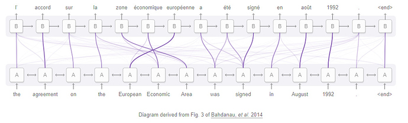

# Attention
   
<그림을 보고 Captioning 하는 예시>   
   
Attention이란 위의 그림과 같이 사람이 그림을 볼 때 특정 부분에 Attention을 하여 어떤 그림인지를 아는 것처럼 컴퓨터로 이를 구현해보고자 하는 것이다.    
   
   
<Attention을 활용한 번역 visualization>   
   
Attention은 번역에도 활용할 수 있다. 위의 그림은 번역을 할 때 attention을 visualization한건데 어떤 단어에 집중 또는 단어 간의 관계로 볼 수도 있다. 선이 진할수록 관계도가 높은 것이다.   
   
Attention은 Q,K,V를 알아야 하는데 

# Self-Attention

"Attention is all you need' 논문에서 나온 개념으로 기존의 Attention과는 달리 Query가 input이다. 즉 자기 자신을 제일 잘 표현할 수 있는 input(key, value) pair를 찾고 그 결과가 가장 좋은 embedding이 된다. 

# Attention Model의 장점
* <strong>해석 가능하다(interpretable)!!!!!!</strong>(model이 어디에 attention을 줘서 그러한 결론을 내렸는지 알 수 있다)
* 각각 layer마다 필요로 하는 총 computing cost가 줄어든다.
* 병렬화가 가능한 computation이 늘어난다.(sequential operation을 필요로 하는 부분이 줄어든다)
* 신경망 내에서 long-range dependencies를 잇는 path length가 줄어든다.

참고 : path length란?
번역 문제 같은 sequence transduction problem에서는 input sequence와 output sequence가 길어지면 두 position간의 거리가 먼 경우에 그 의존성을 학습하기 힘들다는 문제가 있다. 이것을 Maximum Path Length를 이용해 표현하였다. 의존성을 학습하기 위해 거쳐야하는 connection이 최대 몇 단계가 필요한가를 나타내는 수치로서, 이 path의 길이가 짧을수록 position 간의 의존성을 학습하기 쉬워진다고 할 수 있다.

# 참고자료
1. [논문반] Self-Attention Generative Adversarial Networks   
http://www.modulabs.co.kr/DeepLAB_Paper/20167
