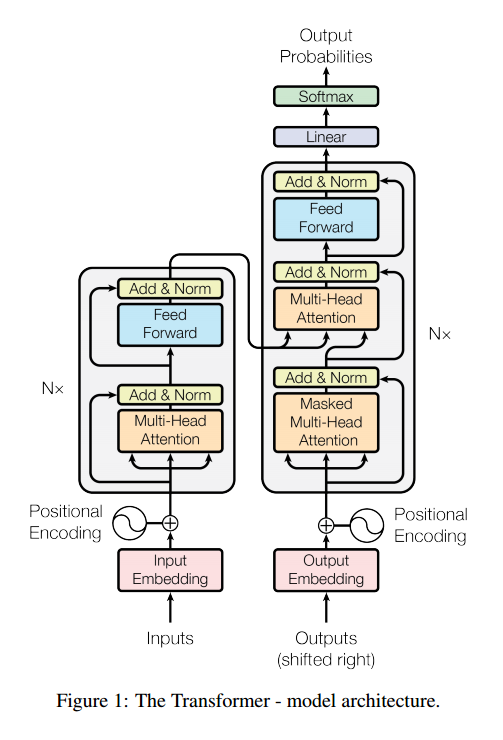

# Attention Network

Attention Network란 사람이 그림을 볼 때 특정 부분에 Attention을 하여 어떤 그림인지를 아는 것처럼 Computer로 이를 구현해보고자 하는 Network이다.

논문 : 현재 대부분의 Sequence model은 cnn이나 rnn을 encoder, decoder로써 활용하고 있다. 그 중 가장 좋은 성능을 보이는 모델은 attention mechanism을 활용한 encoder, decoder 모델이다. 우리는, cnn과 rnn을 없애고 attention에만 기반을 둔 단순한 network인 Transformer를 제안한다. 이를 통해 paralleizable이 가능해졌고, train 시간을 대폭 감소시켰다.

즉, 기존에 cnn과 rnn, attention을 사용하던 걸 attention만 사용하자는 것이다. 논문에서는 Attention만 사용하는 간단한 신경망 구조를 통해 기계 번역 분야(특히, 영어에서 독일어로 번역)에서 state-of-the-art 성능을 얻음과 동시에 computation cost를 줄일 수 있었다고 한다. paralleization은 data를 parallel하게 처리할 수 있도록 computer program이나 system을 설계하는 것을 말한다. (보통 computer program은 data를 serially 처리한다)

RNN 모델은 input과 output sequence의 position들을 계산하는데 뛰어나다. 이 position대로 순서대로 연산을 하면서, 이전 hidden state <strong><i>ht-1</i></strong>와 그 position의 input <strong><i>t</i></strong>를 통해 새로운 hidden state <strong><i>ht</i></strong>를 만들어 낸다. 따라서 구조상 sequential한 특성을 가지고 있기에, 이는 parallelization에 취약하다는 단점이 있다. 이는 sequence길이가 길어진 경우 batch로써 풀고자 할 때 큰 문제가 된다.

# Attention Model의 장점
* <strong>해석 가능하다(interpretable)!!!!!!</strong>(model이 어디에 attention을 줘서 그러한 결론을 내렸는지 알 수 있다)
* 각각 layer마다 필요로 하는 총 computing cost가 줄어든다.
* 병렬화가 가능한 computation이 늘어난다.(sequential operation을 필요로 하는 부분이 줄어든다)
* 신경망 내에서 long-range dependencies를 잇는 path length가 줄어든다.

참고 : path length란?
번역 문제 같은 sequence transduction problem에서는 input sequence와 output sequence가 길어지면 두 position간의 거리가 먼 경우에 그 의존성을 학습하기 힘들다는 문제가 있다. 이것을 Maximum Path Length를 이용해 표현하였다. 의존성을 학습하기 위해 거쳐야하는 connection이 최대 몇 단계가 필요한가를 나타내는 수치로서, 이 path의 길이가 짧을수록 position 간의 의존성을 학습하기 쉬워진다고 할 수 있다.

# Transformer Model Architecture

# 참고자료
1. 논문 - Attention Is All You Need : https://arxiv.org/abs/1706.03762
2. Github - Attention Is All You Need 논문 리뷰 :  https://github.com/YBIGTA/DeepNLP-Study/wiki/Attention-Is-All-You-Need-%EB%85%BC%EB%AC%B8%EB%A6%AC%EB%B7%B0
3. 수업자료
4. Parallelization : https://www.computerhope.com/jargon/p/parallelization.htm
5. 블로그 - 논문 요약 Attention Is All You Need : https://hist0134.blog.me/221035988217

